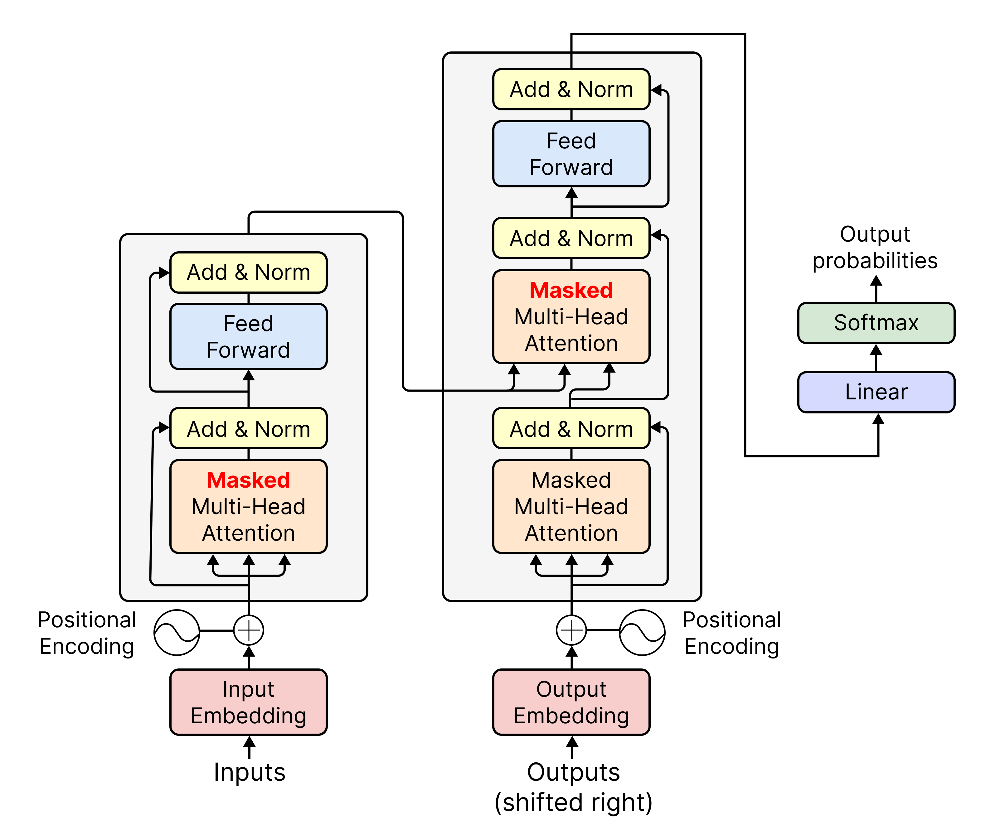
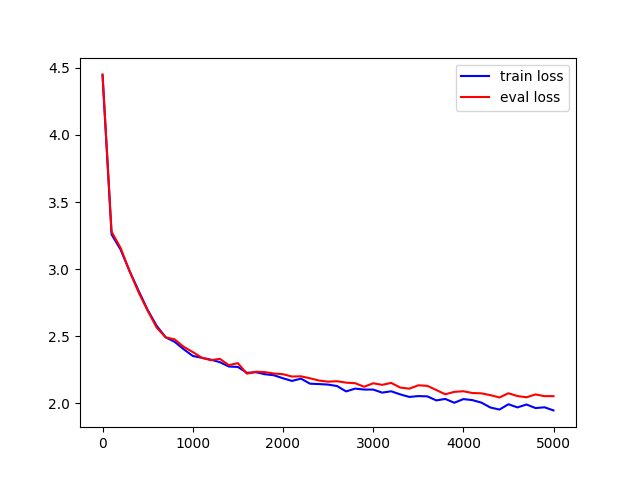

# Masked Transformer

<p align='center'>
    
</p>

This is a Pytorch implementation of a Masked-Attention-only, Encoder-Decoder Transformer. While capable of performing any task that a regular transformer can perform (most of which, however, typically require the masking to be dropped from two of the three attention blocks, [as explained here](#unmasking-the-transformer)), the Transformer defined in this code is specifically designed for <b>text generation</b>, and particularly <b>sequence completion</b>, tasks (hence the masking).

## Model Overview

<p align='center'>
    
</p>

The code follows almost identically the architecture proposed in the [Attention is All You Need](https://arxiv.org/pdf/1706.03762) paper, except for one detail: in the original paper the only <b>Masked</b> Attention Block is the Decoder's Self-Attention block, the other two Attention blocks (meaning the Encoder's Self-Attention block and the Decoder's Cross-Attention block) being unmasked, whereas in this implementation all three Attention blocks are masked.

This was done to ensure that the Transformer can be used specifically for sequence-completion tasks, which require that the identity of future tokens not be given away during training.

## Getting Started

To install the project's dependencies, simply run

    pip install -r requirements.txt

from the project's root directory.

### Train

We trained our model on a corpus consisting of [all of Shakespeare's work](./data/shakespeare.txt), concatenated into a single file, for 5000 epochs, a single encoder and a single decoder blocks, and with the following parameters:

| B | T  | C  | dim_k | dim_v | num_heads | dim_ff |
|---|----|----|-------|-------|-----------|--------|
| 4 | 32 | 64 | 64    | dim_k | 4         | 256    |

where:

- `B`: batch size
- `T`: context (or window) size
- `C`: number of embedding dimensions
- `dim_k`: within [ScaledDotProductAttention](./models/networks/scaled_dot_product_attention.py), the size of the linear projection used to compute <i>Keys</i> and <i>Queries</i>; the linear projection applied by each attention head will have size `dim_k/num_heads`, as described below
- `dim_v`: within [ScaledDotProductAttention](./models/networks/scaled_dot_product_attention.py), the size of the linear projection used to compute the <i>Values</i>; the linear projection applied by each attention head will have size `dim_v/num_heads`, as described below
- `num_heads`: number of attention heads; in order to calculate <i>Keys</i>, <i>Queries</i> and <i>Values</i>, each head will use a projection of size `dim_k/num_heads` for <i>Keys</i> and <i>Queries</i> and `dim_v/num_heads` for the <i>Values</i>; since the outputs of the single heads are then concatenated, the final projections will have size `dim_k/num_heads * num_heads = dim_k` and `dim_v/num_heads * num_heads = dim_v` respectively
- `dim_ff`: within [PositionWiseFeedForwardNetwork](./models/sublayers/position_wise_feed_forward_network.py), size of the hidden layer.

Training was carried without using a GPU. The results are displayed below:

<p align='center'>
    
</p>

In order to start your own training, simply run

    python train.py

from the project's root directory. We encourage you to play around with different parameter values, while keeping in mind that, if you want to increase the model size significantly (and particularly add more Encoder and Decoder blocks), you will likely need to get ahold of a good GPU.

### Unmasking the Transformer

In order to remove the masking from the Encoder's self-attention block and the Decoder's cross-attention block, and therefore revert the architecture to the one proposed in the [Attention is All You Need](https://arxiv.org/pdf/1706.03762) paper, do the following: 

1. in [encoder.py](./models/blocks/encoder.py), modify the line
    ```python
    self.multi_head_att = MultiHeadAttention(C, dim_k, dim_v, num_heads, masked=True)
    ```
    to
    ```python
    self.multi_head_att = MultiHeadAttention(C, dim_k, dim_v, num_heads, masked=False)
    ```
2. in [decoder.py](./models/blocks/decoder.py), modify the line
    ```python
    self.cross_multi_head_att = MultiHeadAttention(
        C, dim_k//num_heads, dim_v//num_heads, num_heads, masked=True
    )
    ```
    to
    ```python
    self.cross_multi_head_att = MultiHeadAttention(
        C, dim_k//num_heads, dim_v//num_heads, num_heads, masked=False
    )
    ```

Keep in mind that unmasking is typically needed for most tasks other than sequente completion.

### Inference

To run inference, call `Transformer.generate`, which takes two parameters:

- `idx`: a `torch.Tensor` with the initial token sequence
- `max_new_tokens`: an `int` defining how many new tokens should be appended to `idx`

and them decode the output with the `decode` function

```python
import torch

from data import decode
from models.transformer.transformer import Transformer


m = Transformer(vocab_size, C, T, dim_ff, dim_k, dim_v, num_heads, device)

starting_output = torch.zeros((1, 1), dtype=torch.long)
output = m.generate(starting_output, 200)
print(decode(output[0].tolist()))
```